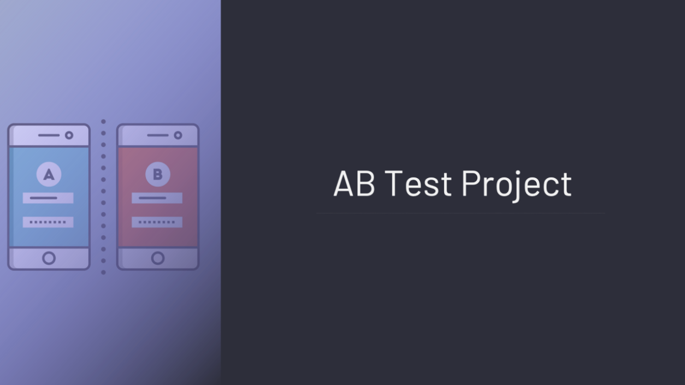

# Facebook-AB-Testing-Project

 

## Business Problem 

Facebook recently introduced a new bidding type, **"average bidding"**, as an alternative to the existing bidding type called **"maximum bidding"**. One of our customers has decided to test this new feature and wants to do an A/B test to see if average bidding converts more than maximum bidding. A/B testing has been going on for 1 month and the client is now waiting for us to analyze the results of this A/B test. The ultimate success criterion for the customer is Purchase. Therefore, the focus should be on Purchasemetric for statistical testing.

## Dataset Story

In this dataset, which includes the website information of a company, there is information such as the number of advertisements that users see and click, as well as earnings information from here. There are two separate data sets, the control and test groups. These datasets are in separate sheets of the **ab_testing.xlsx** excel. Maximum Bidding was applied to the control group and Average Bidding was applied to the test group.

## Features of Dataset

- **Total Features :** 4
- **Total Row :** 40
- **CSV File Size:** 26 KB

## Variable Descriptions

**Impression:** Number of ad views

**Click:** Number of clicks on the displayed ad

**Purchase:** The number of products purchased after the ads clicked

**Earning:** Earnings after purchased items
